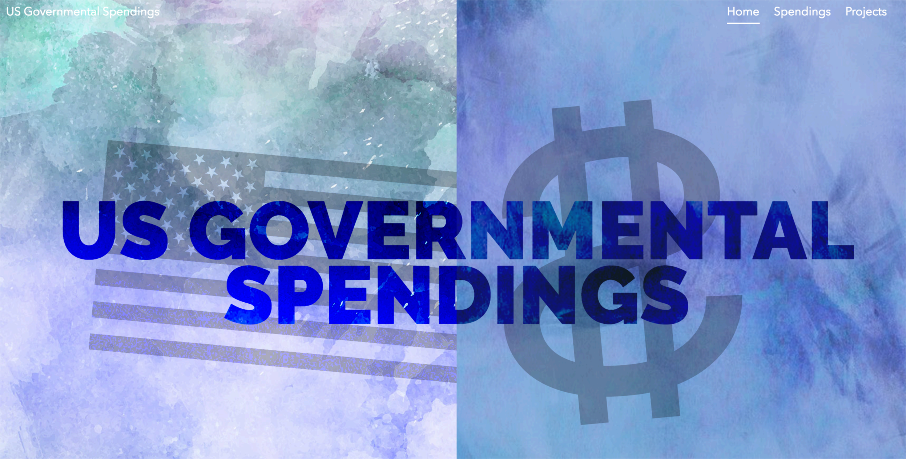
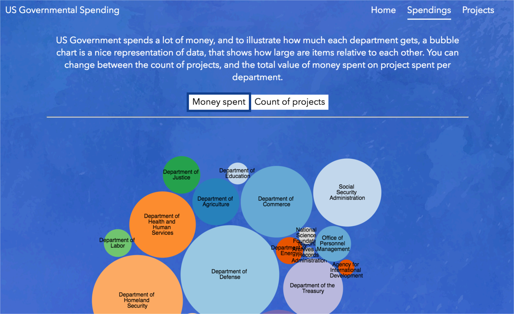
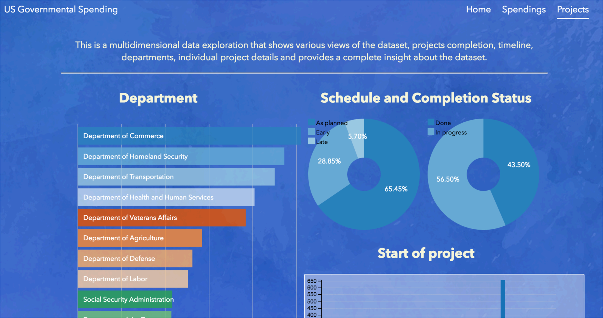
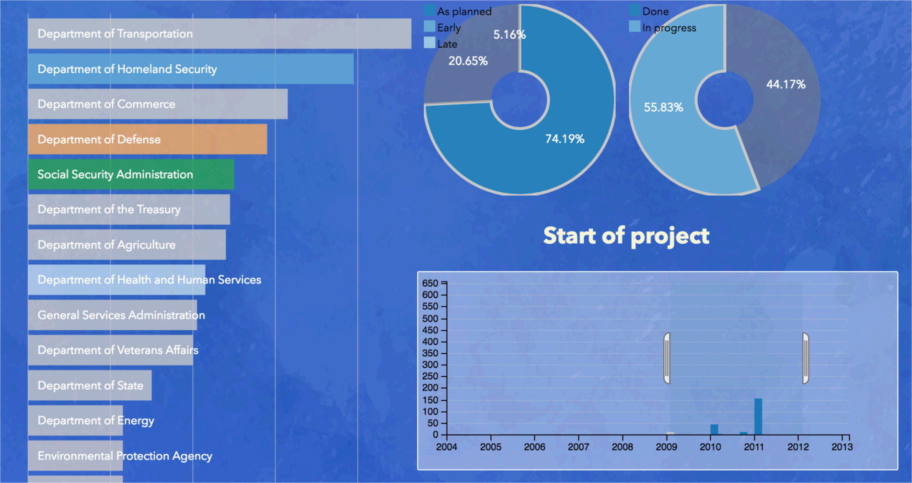
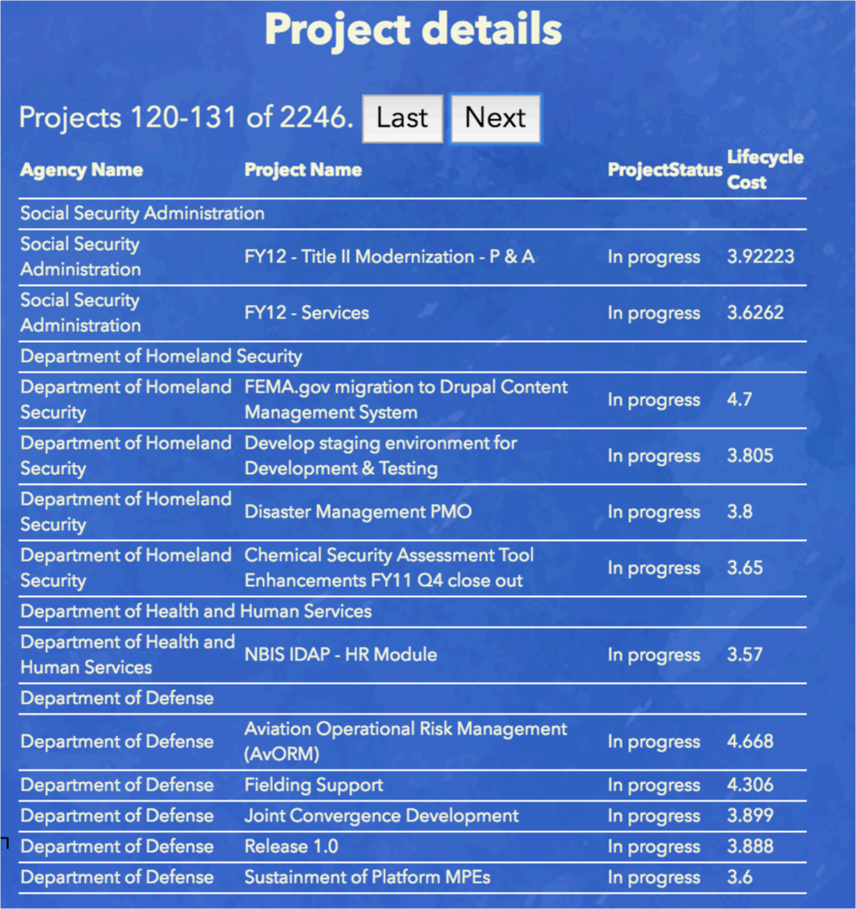

# Data visualization using D3: US Governmental spending

## ABSTRACT
To analyse the large data sets, it is useful to have a multidimensional visualisation that explores different aspects of the data set. This paper deals with cleaning a dataset about US governmental spending and coding a website that uses advanced visualisation techniques to show the data in a human readable and understandable way.

## 1 INTRODUCTION
This report details how the processing and visualization of dataset of US governmental spending was performed. First, data was cleaned using OpenRefine. Then, data was used with D3 to visualize it. Following, the web application was designed to provide users with a story about data. Finally, result is the website available at: http://ahmet.com.ba/us-governmental-spendings/

## 2 METHODS

Dataset was cleaned using OpenRefine open source tool. Following mistakes were found in the dataset:

- unnecessary data at the beginning of the file
- removal of 'total' rows, 26 of them
- agency names have issues (clustering of whitespace, trailing etc), fixing typos (Agraculture/Agriculture, Transport/Transportation, SSA/Social Security Administration)
- shorthand versions were converted to full names: DOD, Department of Defense
- empty columns were removed
- budgets that were not numbers were removed
- costs were fixed, negative values, using numeric faccets
- unreasonable costs were removed, like values in trillions
Following this, the skeleton for the design of the website was prepared. Design is shown on Figure 1, and was inspired by [article on Codrops](https://tympanus.net/codrops/2017/01/04/mirror-effect/).

Figure 1. Landing page

Following, dataset was exported CSV and used with [D3](https://d3js.org/) tool to create several types of visualizations, like bubble chart.

Figure 2. Bubble chart illustrating projects/spending

After this, the *Projects* part of the visualization was completed, which shows an interactive exploration of the dataset. Users can explore spending per departments, project details, timelines, as well as project completion and delay status. All values are connected, so, for example, selecting a department will update the timeline and project details and all other charts.

Figure 3. Projects page, showing different departments, pie charts for completion and timeline for project starting dates.

Figure 4. Usage of multiple filters, from pie charts, department filter, as well as timeline filtering, all working to update the Project details screen, shown on Figure 5.

Figure 5. Project details screen, showing the list of projects, grouped by department. This is a result from the filters applied in Figure 4.

The *audience* for these visualisations is the general public, as well as various NGOs, other governmental organisations or anyone interested to see how it the government spending money, which departments get most of the funds.

First chart can be changed to show total number of projects, and total budgets, which really illustrate which Departments have most of the projects, and most of the budget.

Second, more complex visualisation shows more details. Users can see completion status per departments, following the schedule, which projects are in which department and timeframes.

Some additional columns were added, like ProjectStatus, in order to visualise data better.

## 4 CONCLUSIONS
OpenRefine is a very useful tool that provides ability to clean the datasets, which, like in this example, can have a lot of errors. D3 is a powerful tool that illustrates that even a complex dataset can be visualised in an easy-to-read format. Combination of these tools can result in modern web applications that deal with specific topics and inform targeted users about patterns in data.
